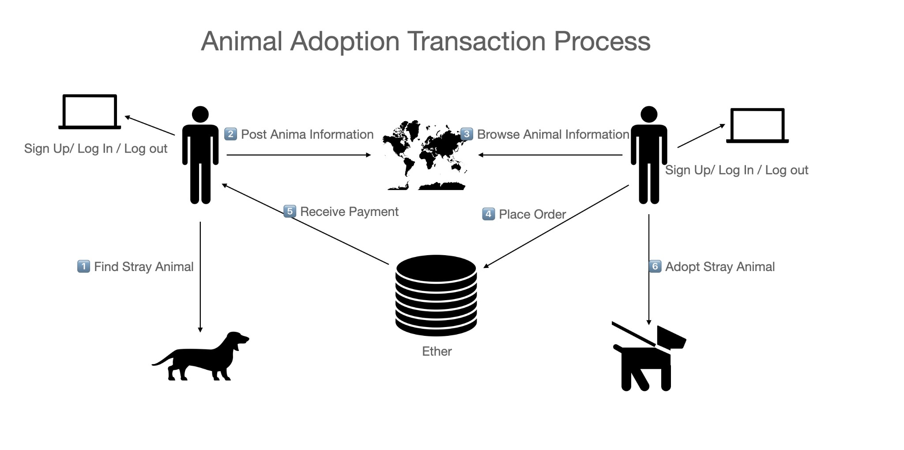
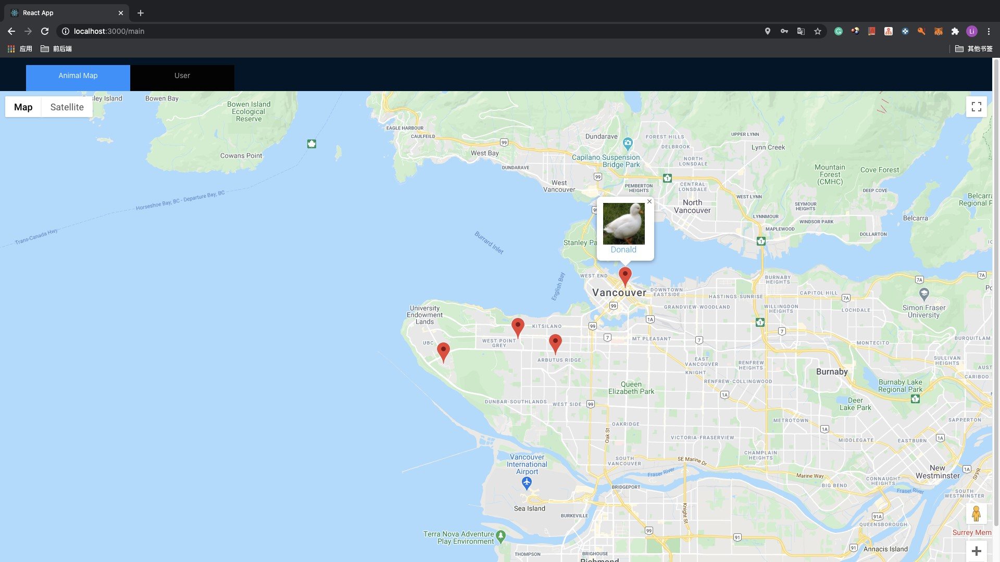
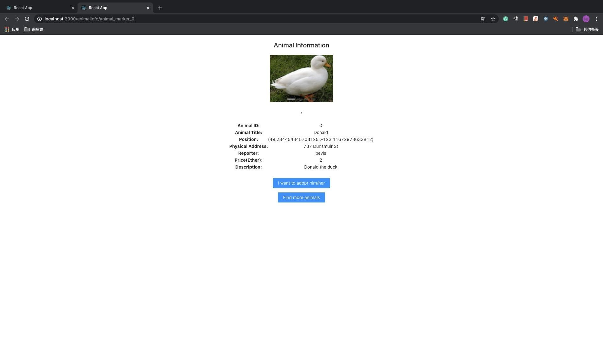
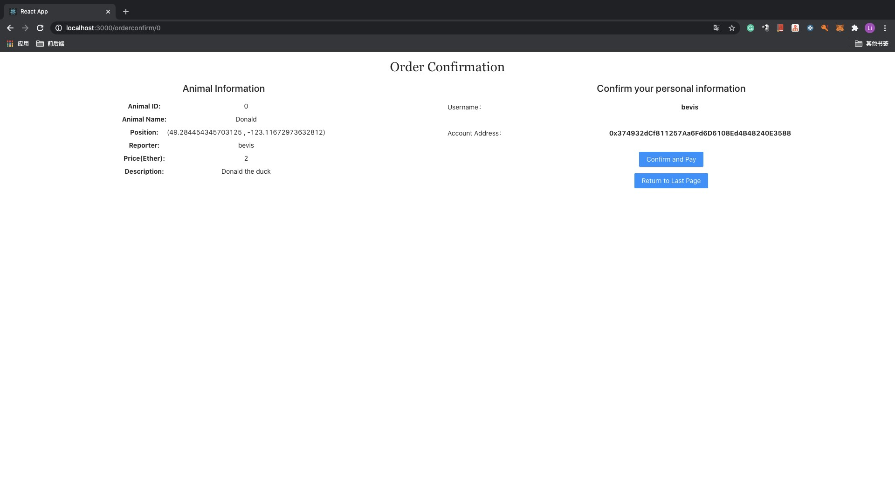
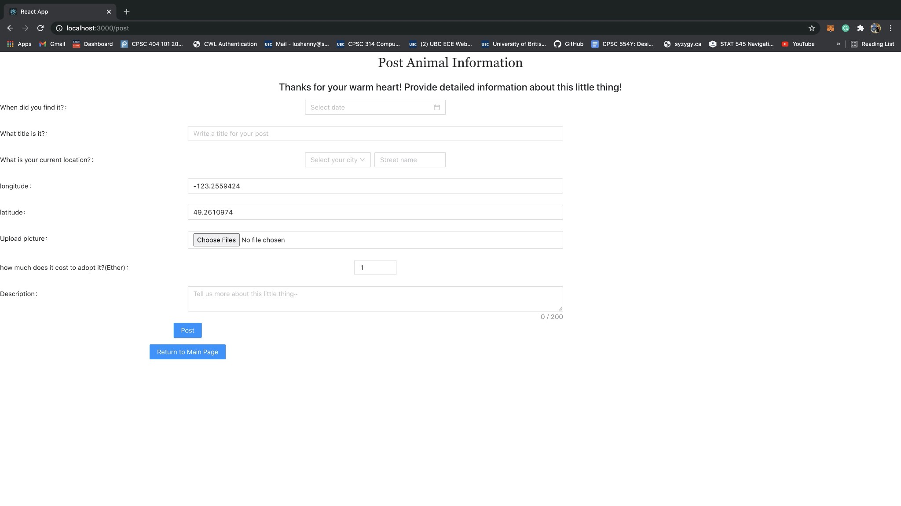
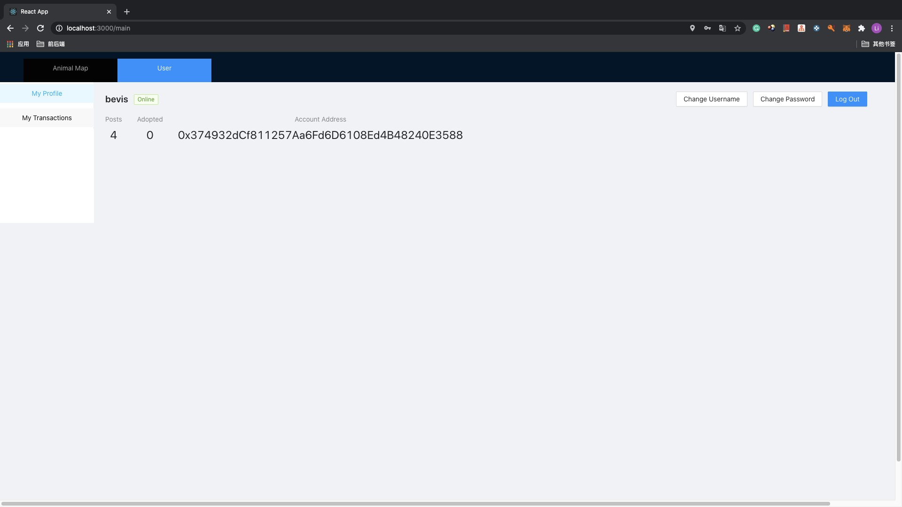

# EECE 571G Term Project: Animadopt 
Code & documentation for the EECE 571G term project: Animal Adoption DApp

Authored by Li Ju, Runze Wang, Shanny Lu, Shijun Shen

## Brief Introducion to Our Project
- Stray animal mobile applications are popular all over the world to resolve the stray animal issues. However, according to the current situation, those issues haven't been effectively resolved in most cities. So, there is still a long way to go in resolving stray animals’ problems.<br/> 
- To help solve these issues, in our project report, an short-distance animal adoption decentralized application, **Animadopt**, was designed and programmed using React.js with Javascript as the main front-end language and Solidity as the back-end programming language. <br/> 
- The application enables users to post, share and adopt the stray animals on the Google Maps APIs in the form of markers and secures the transaction as users in Dapps can transact directly with each other using cryptocurrencies without third-party disturbing. This work provides a relatively convenient tool for pet-lovers to put their joint efforts to help stray animals find their new home.
<br/>


## Screenshots of Our Project

### map
> To present users with a map including all the information of stray animals, we invoke Google Maps APIs for animal position visualization. Every animal posted on our site can be represented by a mark in the real-time map, with a preview image popping up for users to browse. 
<br/>


### animal information
> Once a user clicks on a marker, the user will be redirected to a page containing specified animal information related to the marker, with its photos displayed in carousel mode, location, price in ether, and people who post this information.
If a user is interested in adopting this animal, he/she can choose to adopt this animal by clicking the “I want to adopt it” button. Otherwise, they can also return to the main page to browse more options.
<br/>


### order confirmation
> If a user decides to adopt an animal, he/she will be linked to the order confirmation page. In this page, After reviewing everything he/she needs to know about this transaction, the user can choose to confirm the payment, which will awake metamask to deal with the ether transfer part, or to change his/her mind and go back to the animal information page.
<br/>


### post
> This page is designed for users to post any animal he/she has found and look for potential adopters. In this page, user should enter as many details as they can about the stray animal, including but not limited to: the time when they find the animal, their current location(displayed in latitude and longitude), the price they want to put on the animal(unit: ether), photos the user takes about the animal, and all other necessary information for other animal lovers to know more about this animal.
<br/>


### user profile
> User profile page consists of a user’s personal information, including user’s username, ethereum account address, and the number of animals he has ever adopted and posted. Besides, the user can change his/her username, password, or log out to sign in using another account.
<br/>


### user transacion records
> User transaction page is designed to collect all the transaction records of a user and display it in the form of an expandable table. The table entry in the main table shows the username of your seller/buyer and the date when the transaction happened. When you click the “+” button on the left of every table entry, a sub table appears and every entry of it records the information about the ether transaction with regards to the transaction in our site.
<br/>


## How to run

Note: Make sure the version of **nvm** you are using is *v12.13.0*. If your nvm current version is not *v12.13.0*. Switch to version *12.13.0* by using
<code>
nvm use 12.13.0
</code>.

##### How to check your nvm version

```sh
$ nvm version
```

### 1. Clone Repository

```sh
$ git clone https://github.com/shannelu/AnimalAdoption-DApp.git
$ cd AnimalAdoption-DApp/animal_adoption_dapp
```
    
### 2. Install Dependencies

```sh
$ npm install
```
    
### 3. Run Dapp

##### Start up Ganache-cli or GUI

```sh
$ ./ganache-cli
```

##### Deploy contract
```sh
$ truffle migrate
```

##### Run Animal AdoptionRun Dapp
```sh
$ npm start
```
Browser will launch on [http://localhost:3000/signin](http://localhost:3000/signin).
